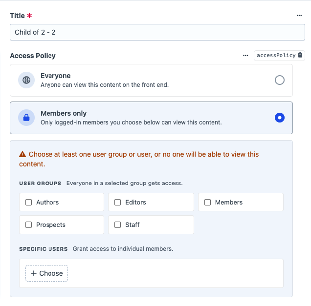
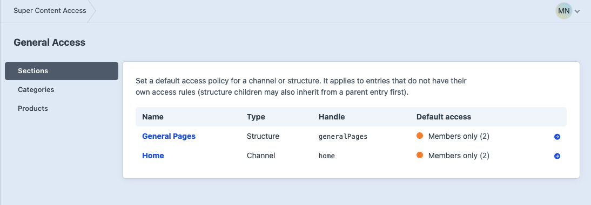
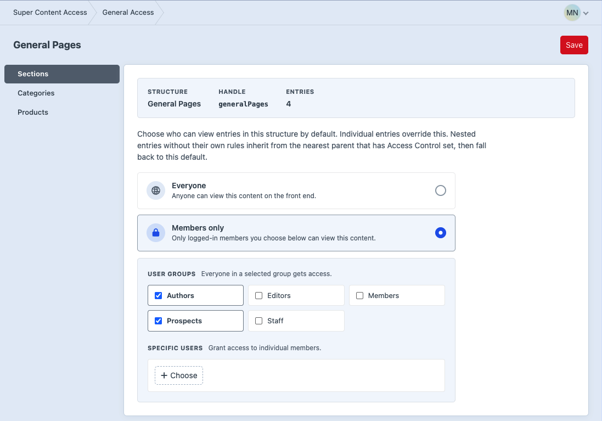
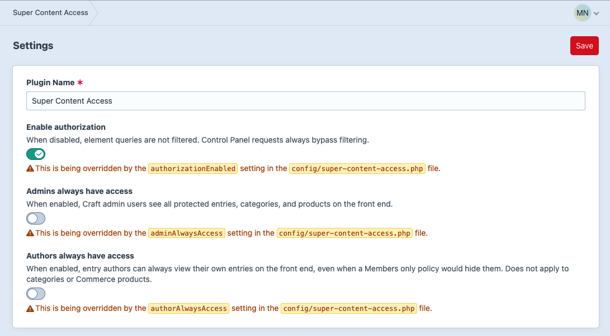
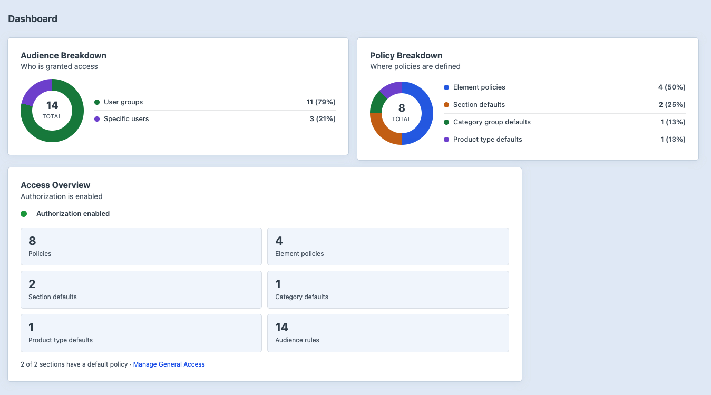

# Backend Guide

The plugin adds a **Super Content Access** section to the Craft Control Panel.

## Navigation

Main sections:

- **General Access** — defaults for sections (channels & structures), category groups, and product types.
- **Settings** — plugin name and authorization toggle.

The plugin nav stays expanded while you are on any Super Content Access URL. Native Craft breadcrumbs appear on General Access and Settings screens.

## Access Control Field

Add the **Access Control** field to an entry type, category group, or product type field layout.

On the element edit screen you can:

- Choose **Everyone** (public — no element policy).
- Choose **Members only**, then select user groups and/or specific users.
- See a warning when Members only is enabled with no audiences (fail-closed).



Saving writes to plugin tables (`super_content_access_*`), not Craft field content. The field uses `dbType: null`.

Drafts: submitted values persist against the **canonical** element ID.

## Element Sidebar Summary

The meta sidebar shows a read-only **Access** band for entries, categories, and products:

- Badge: **Public** or **Members only**.
- Source note: set on this element, inherited from a structure parent, or inherited from the matching General Access default (with link).
- Audience chips for groups and users when restricted.

The sidebar does not edit policies. Use the Access Control field (or General Access for defaults).

The summary is hidden when access is fully public **and** the layout has no Access Control field.

## General Access

Sidebar scopes:

- **Sections** — Craft channel and structure sections (singles omitted)
- **Categories** — category groups
- **Products** — Commerce product types (shown only when Commerce is installed and enabled)



For structure entries, categories, and structured Commerce products, effective access is:

1. Access Control on the element itself
2. Else nearest parent (or ancestor) that has Access Control set
3. Else the matching General Access default (section / category group / product type)
4. Else public

Channel and single entries, and flat (non-structure) product types, skip step 2.

### Sections

```text
/admin/super-content-access/access/channels
```

Lists every Craft **channel** and **structure** section. Click a section to set its default policy. Choosing Everyone removes the section-scoped policy.



Singles are not listed — configure access on the single entry.

### Category groups

```text
/admin/super-content-access/access/categories
```

Same editor pattern for each category group. Nested categories inherit from parents before the group default.

### Product types

```text
/admin/super-content-access/access/products
```

Same editor pattern for each Commerce product type. When the type is structured, nested products inherit from parents before the type default.

Requires `super-content-access:manage-policies`.

## Settings

URL:

```text
/admin/super-content-access/settings
```

- **Plugin Name**
- **Enable authorization**
- **Admins always have access** — Craft admins see all protected content on the front end
- **Authors always have access** — entry authors always see their own entries (entries only; not categories or products)

Requires a Craft admin user. When `allowAdminChanges` is `false` in `config/general.php`, the settings screen is still visible but read-only (fields disabled, save blocked)—same behaviour as Super Favourite.

Prefer `config/super-content-access.php` for environment-specific control (for example enable only in production via `App::env('CRAFT_ENVIRONMENT')`). Any key in that file overrides the CP value and shows a warning under the field. See [Installation — Config file](installation.md#config-file).



## Dashboard Widgets

From the Craft dashboard, add:

- **Access Overview** — authorization status and policy counts, plus a link to General Access.
- **Access Breakdown** — doughnut chart; widget settings choose policy location or audience type.


